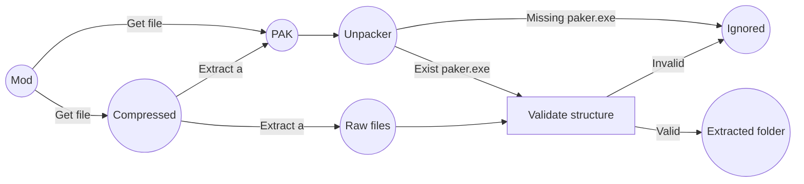

# Marvel Rivals - Mod Manager
Mod manager build up using **WinUI3**, which was made in mind as a tool to be compatible with the Season 0 (using ~mods folder) and Season 1 (using raw files on the game content folder)

## Important
The manager do not provide the raw files that would be used to patch mod needed for the method of the Season 1, this files can be extracted from the yout own game content folder (`Paks` folder) and the copied to your content folder. Nevertheless the manager has a section that you can download a copy to later restore via manager.

## How mods work on Marvel Rivals
In Season 0, mods in `.pak` format only needed to be placed directly into the ~mods folder in order to be used.

In Season 1, mods in order to be used must be unzipped (files in `.pak` format) and all mod files placed directly into the game's content folder.

## How to configure the manager
For the Season 0, only it's needed to set the *Enabled* folder to the ~mods on the game content directory.

For the Season 1, it's needed to download (can be using the manager or another source) or extract the `.pak` files from the game content, and then match each category folder with it's respective `.pak` file.

Each category represent the following files of the original game:
- *Characters*: `pakchunkCharacter-Windows.pak`
- *Movies*: `pakchunkHQ-Windows.pak` and  `pakchunkLQ-Windows.pak`
- *UI*: `pakchunkMovies-Windows.pak`
- *Audio*: `pakchunkWwise-Windows.pak`

# Mod manager
The mod manager is separated on three views, which are related between each other thought a layer of services.

## Settings
Here you configure the directories necessary for the manager to work correctly. By default only the when the app is launched the first time (due it would create aa file `usersettings.json` to store the settings variables), it would create the folder **_MarvelRivalModManager_** on `C:\Users\Public\Documents\`. This default configuration can be change any time later.

 - **Content Folder**
Represent where the game content is located and where the mod would be deployed for the Season 1, the manager would try, on the first time is launched, to locate the Steam folder using the public registry values related to steam (`SOFTWARE\VALVE\` and `SOFTWARE\Wow6432Node\Valve\`) . For example, on Steam is located in `~/steamapp/common/Marvel Rivals/MarvelGame/Marvel/Content`.

 - **Mod directories**
Represents the directories used to manage the enabled and disabled states of mods. This was made on this way to maintain compatibility with the Season 0 mod management, and for later use when a proper mod bypass for Season 1 is made.
	
	There are two directories for this section *Enabled* and *Disabled* folder, were both are identical on structure. On the root of the folder the mods are stored, and a *profile* folder is created were each mod metadata is stored. Also if exists any image related for a mod, a folder *images* is created to store all the images related to the mod folder.
	
 - **Unpacker**
Represent were the mods are unpacked and merged to later be patched on the game content folder, also it contains the unpacker program (`repak.exe`) which is used to unpack `.pak` files with no hash password.

 - **Backups**
Represent were the backup of the encrypted `.pak` file of the game are stored for later use on restore options and to remove unused/disabled mods when are disabled for the method used for Season 1
	
	This folders are directly the files of the game, which are categorized to better control which files and mod types to apply. This files can be obtained via *Fmodel* or downloading a copy of this files. 
	
	 Each category represent the following files of the original game:
    - *Characters*: `pakchunkCharacter-Windows.pak`
    - *Movies*: `pakchunkHQ-Windows.pak` and  `pakchunkLQ-Windows.pak`
    - *UI*: `pakchunkMovies-Windows.pak`
    - *Audio*: `pakchunkWwise-Windows.pak`

## Manager
The manager separate the mods into two sections *Enabled* and *Disabled*, which each one represent a folder, described on the **Settings** section, and by default only *Enabled* mods would be patch into the game raw files.

 The manager has a command bar with two options: 
 - Add: Open a dialog up to select a single o multiple mods, on formats (`.pak`, `.zip`, `.rar` and `.7z`). When a mod is added the mod would be decompressed to generate the metadata of the mod, in the case of the `.pak` files it would try to unpack it using the *unpacker* described on **Settings** section.
 - Remove: Delete selected the mods from the lists and related content, metadata and images.

Next to the command bar, there is a search box, which you can filter mods of the list using the field *Name* and *Tags* (this include the system tags and custom tags). 

To enable/disable a mod, you can select multiple mods and later just drag'n drop on the other list, each mod hace a context menu, which have the following options: 
 - Move: Move the mod to the othe list (enabled/disabled).
 - Edit: Open editor view where you can edit some metadata of the mod like the name, logo and custom tags for search on the bar.
 - Delete: Delete selected the mod related content, metadata and images.

## Actions
The actions view is more dedicated to apply the raw files of the mods (compressed or on `.pak ` format).

- **Unpack**
Retrieve all the mods on the *Enabled* list, and try to unpack into raw files and merge all this content into a folder called `extraction`, located on the **Unpacker** folder, to later be patched on the game folder thought the *Patch* option.

-  **Patch**
Retrieve all the mods that are marked as *unpacked* and move all the unpacked content to the game folder content. If there is a disabled mod that is *unpacked* the manager would try to remove the files affected on the extraction folder. If there are any mod already deployed but inactive the manager would try to restore the files from the *Backups* folder, described on the **Settings** section, and remove any that do not exist.
> If the manager report that a file cannot be restored and the previous mod is still applied, is recommended to restore the oriinal files using the *Restore* options, this probably is due the files added/modified of the mod. 

- **Restore**
	Replace all the files of the content folder using the *Backups* folder, described on the **Settings** section.
	> You can select specific category to restore is needed 

- **Enable/Disable**
	This option only rename the files of the `Paks` folder of the game content folder, this is needed to enable/disable in general the mods, due the game would try to load the specific `.pak` file, if not exist would try to load the raw files on the game content folder.
	
	 Each category represent the following files of the original game:
    - *Characters*: `pakchunkCharacter-Windows.pak`
    - *Movies*: `pakchunkHQ-Windows.pak` and  `pakchunkLQ-Windows.pak`
    - *UI*: `pakchunkMovies-Windows.pak`
    - *Audio*: `pakchunkWwise-Windows.pak`
 
	> You can select specific category to restore is needed 

- **Download**
	This options would try to download from [Mega folder](https://mega.nz/folder/m1xmxT4Y#J-wEYO5NyLgT_WWG13CMzA) the files needed to the manager to work as the `repak.exe` and the backups
	> The current backups uploaded are the Season 1 content

- **Clear**
	Only clear the logs of the console.
